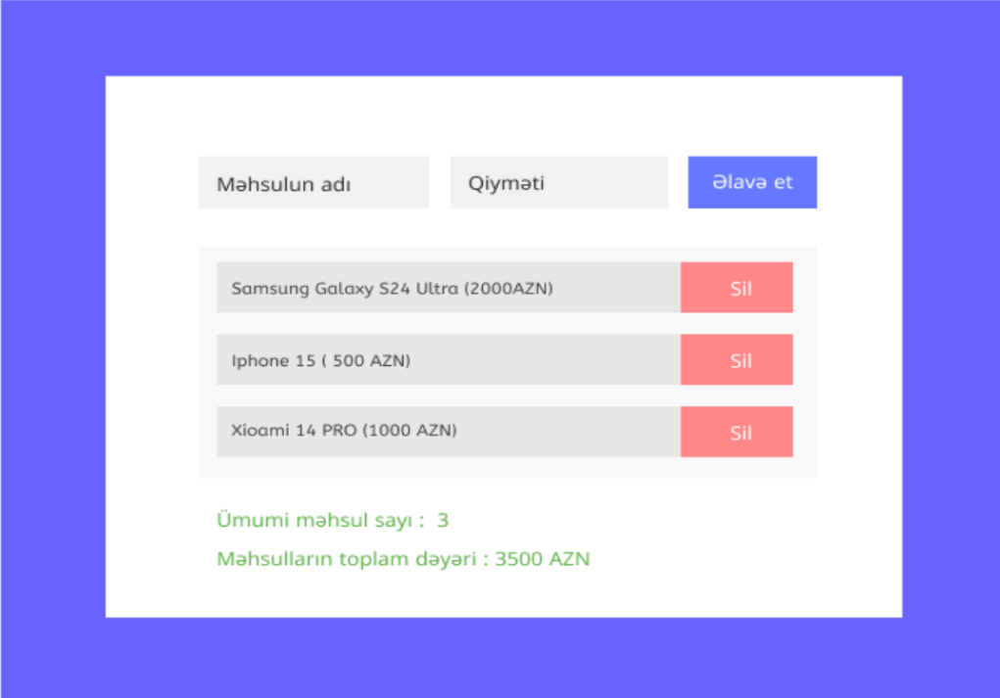

# Məhsul Bazası Simulyasiyası

Bu layihə, məhsulların əlavə edilməsi, silinməsi, sayı və ümumi qiymətinin hesablanması funksionallıqlarını təmin edən sadə bir veb tətbiqidir. Məhsulların siyahısı localStorage-də saxlanılır, beləliklə səhifə yeniləndikdə məlumatlar itməz.

## İstifadə Edilən Texnologiyalar

- **HTML**: Səhifənin strukturunu təmin edir.
- **CSS**: Dizayn və görünüşü tənzimləyir.
- **JavaScript**: Məhsulların əlavə edilməsi, silinməsi və localStorage ilə işləməsini təmin edir.

## Layihə Qovluq Strukturu

    Task
        ├── index.html
        ├── readme.md
        ├── script
            ├── script.js
        ├── styles
            ├── style.css
            
## Xüsusiyyətlər

- **Məhsul Əlavə Etmək**: Məhsulun adı və qiymətini daxil edərək məhsul siyahısına əlavə etmək.
- **Məhsulu Silmək**: Siyahıda göstərilən məhsulları silmək.
- **Dinamik Say və Qiymət Hesabı**: Məhsulların sayı və ümumi qiyməti dinamik olaraq yenilənir.
- **Məlumatların Saxlanması**: Məhsul siyahısı localStorage-də saxlanılır, beləliklə səhifə yeniləndikdə məlumatlar itməz.
- **Scroll Sahəsi**: Məhsul siyahısı müəyyən bir hündürlüyü aşdıqda, scroll sahəsi təmin edilir, beləliklə səhifə özü scroll olunmaz.

## Quraşdırma və İstifadə

1. Layihə fayllarını bir qovluğa köçürün.
2. Brauzerdə `index.html` faylını açın.

## Qeyd

- `product-list` sahəsi maksimum 300px hündürlüyə malikdir və məhsulların sayı artdıqca scroll olunacaq.
- Tətbiqdə səhifə yeniləndikdə belə məhsul siyahısının itməməsi üçün localStorage istifadə olunur.

## Ekran Görüntüsü

## Müəllif

Bu layihə, ön tərəf texnologiyaları (HTML, CSS, JavaScript) istifadə edərək sadə bir veb tətbiqi qurmaq üçün nəzərdə tutulmuşdur.
